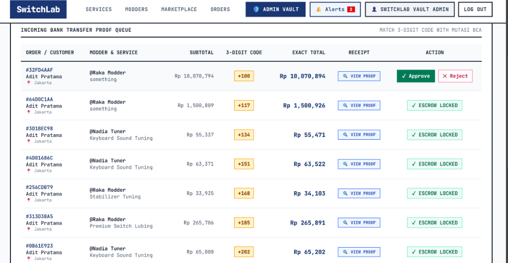
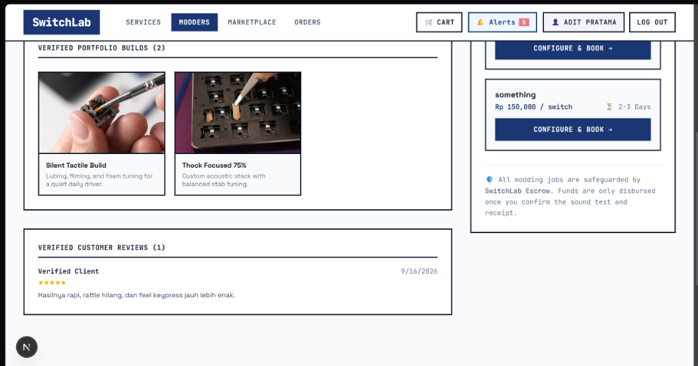
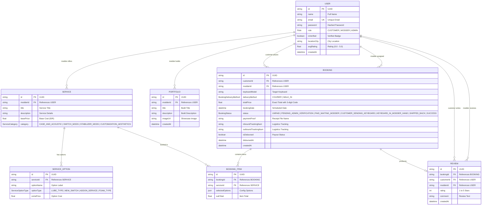

# SwitchLab Frontend

> **Modern Mechanical Keyboard Customization & Escrow Marketplace Web Application**  
> Built with **Next.js 16 (App Router)**, **React 19**, **Tailwind CSS 4**, and **TypeScript**.

---

## 🌐 Live Deployments

| Service | Platform | Live URL |
|---|---|---|
| **Frontend Web Application** | Vercel | [https://crack-fe-sayiki.vercel.app](https://crack-fe-sayiki.vercel.app) |
| **Backend REST API** | Render | [https://crack-be-sayiki.onrender.com](https://crack-be-sayiki.onrender.com) |

---

## 📑 Table of Contents
- [Project Description](#-project-description)
- [List of Features](#-list-of-features)
- [Tech Stack Used](#-tech-stack-used)
- [Application Screenshots](#-application-screenshots)
- [Entity Relationship Diagram (ERD)](#-entity-relationship-diagram-erd)
- [Page & Directory Structure](#-page--directory-structure)
- [Role-Based Views](#-role-based-views)
- [Installation and Usage Instructions](#-installation-and-usage-instructions)
- [Environment Configuration](#-environment-configuration)
- [Build & Deployment](#-build--deployment)

---

## 🚀 Project Description

**SwitchLab** is an interactive web marketplace that bridges the gap between keyboard enthusiasts and artisan modders across Indonesia. 

Enthusiasts can browse tuning packages (switch lubing, filming, stabilizer balance, case acoustic tuning), explore modder showcase builds, and place bookings safeguarded by an Escrow Vault. Payments are deposited into an escrow vault with unique 3-digit verification codes matching BCA bank statements, and funds are only released to modders once the customer receives and confirms the acoustic quality and typing feel of their build.

---

## ✨ List of Features

1. **Marketplace & Catalog Search**:
   - Filterable catalog by categories (`SWITCH_MODS`, `STABILIZER_MODS`, `CASE_AND_ACOUSTIC`, `CUSTOMIZATION_AESTHETICS`).
   - Dynamic search query parsing with Suspense boundary CSR bailout protection.
   - Interactive live database counters showing active modders and verified listings.

2. **Modder Showcase & Directory**:
   - Verified modder profiles with location tags, trust ratings, and past build portfolios.
   - Interactive sound test audio players for listening to modded switch acoustics.

3. **Escrow Booking & Checkout Pipeline**:
   - Customizable service configuration with real-time price calculation.
   - Delivery method selection: Courier Logistics (JNE/J&T/Instant) or In-Person Studio Walk-In.
   - Automated 3-digit escrow verification code generator.
   - Proof of payment receipt upload.

4. **Escrow Lifecycle & Logistics Tracking**:
   - Real-time status badges (`PENDING_ADMIN_VERIFICATION`, `PAID_WAITING_MODDER`, `KEYBOARD_IN_MODDER_HAND`, `SHIPPED_BACK`, `SUCCESS`).
   - Dual-tracking system (Inbound from Customer ➔ Modder; Outbound from Modder ➔ Customer).
   - One-click customer escrow release button.
   - Post-completion 5-star rating and review modal.

5. **Modder Studio & Admin Escrow Vault**:
   - **Modder Studio**: Modders manage incoming bookings, update tracking numbers, and publish new service packages or builds.
   - **Admin Vault**: Dedicated admin portal to verify incoming bank transfer proofs against BCA mutations, approve payments, and execute modder disbursements.

6. **Authentication & Session Persistence**:
   - JWT authentication integrated with localStorage and cookies for middleware edge support.
   - Seamless role switching and access-controlled navigation.

---

## 🛠️ Tech Stack Used

| Layer | Technology | Purpose |
|---|---|---|
| **Framework** | Next.js 16.2.9 (App Router) | Server-side rendering, static site generation, and Turbopack bundling |
| **UI Library** | React 19 | Component lifecycle and reactive UI states |
| **Styling** | Tailwind CSS 4 | Custom design system with industrial mechanical keyboard theme |
| **Language** | TypeScript 5 | Strict type definitions across pages, components, and API responses |
| **Icons & Assets** | Custom SVGs & WebP | High-performance vector icons and optimized image assets |
| **API Client** | Native `fetch` with Bearer Auth | Centralized HTTP client communicating with NestJS backend |
| **Deployment** | Vercel | Production hosting with edge network CDN |

---

## 📸 Application Screenshots

### 1. Payment Verification & Confirmation Screen
Confirmation screen displaying the order reference, exact transfer total, and the 3-digit verification code.


### 2. Admin Escrow Vault & Transfer Proof Queue
Admin dashboard where vault managers match incoming customer transfer receipts against BCA bank statements.


### 3. Order Tracking & Escrow Milestone Flow
Interactive customer tracking screen with modder workbench notes, audio clip sound test station, logistics tracking, and escrow release action.


### 4. Marketplace Directory & Modder Profiles
Showcase directory displaying verified artisan modders, custom workbench builds, and acoustic tuning packages.


---

## 📊 Entity Relationship Diagram (ERD)

The frontend consumes and renders data structured around the following relational database schema:



---

## 📁 Page & Directory Structure

```text
src/
├── app/
│   ├── layout.tsx             # Root layout with Header and Footer navigation
│   ├── page.tsx               # Homepage with hero section and featured categories
│   ├── login/page.tsx         # User authentication with redirect handler
│   ├── register/page.tsx      # Registration with role selection (CUSTOMER / MODDER)
│   ├── search/page.tsx        # Marketplace catalog search with Suspense boundary
│   ├── services/page.tsx      # Comprehensive list of tuning packages
│   ├── service/[id]/page.tsx  # Service detail & configuration booking page
│   ├── modders/page.tsx       # Modder discovery directory & build showcases
│   ├── modders/[id]/page.tsx  # Modder profile, reputation, and portfolio builds
│   ├── cart/page.tsx          # Cart checkout, delivery tier, and escrow paywall
│   ├── orders/page.tsx        # Customer order dashboard with active vs completed sorting
│   ├── orders/[id]/page.tsx   # Escrow tracking station, workbench notes, and release
│   ├── modder/
│   │   ├── dashboard/page.tsx # Modder workbench management & active bookings
│   │   └── create-listing/    # Publish new modding services
│   └── admin/page.tsx         # Admin Escrow Vault, payment queue & disbursements
├── components/
│   ├── Button.tsx             # Standardized button variants (primary, secondary, danger)
│   └── Input.tsx              # Styled form input component
└── lib/
    ├── api.ts                 # Centralized API client connecting to NestJS backend
    └── notifications.ts       # In-app notification dispatcher across roles
```

---

## 👥 Role-Based Views

- **`CUSTOMER`**:
  - Browse tuning packages and artisan showcases.
  - Configure services, select courier or studio walk-in, and submit payment proofs.
  - Track workbench stages, listen to sound test clips, and release escrow funds.
  - Submit ratings and reviews.
- **`MODDER`**:
  - Access **Modder Studio** (`/modder/dashboard`).
  - Create and manage tuning service listings (`/modder/create-listing`).
  - Advance orders through workbench stages and dispatch outbound tracking.
- **`ADMIN`**:
  - Access **Admin Escrow Vault** (`/admin`).
  - Match customer transfer receipts against BCA bank statements with 3-digit codes.
  - Approve payments into escrow or reject invalid proofs.
  - Disburse completed order earnings to modders.

---

## 💻 Installation and Usage Instructions

### 1. Prerequisites
- **Node.js**: v18.0.0 or higher (v20+ recommended)
- **npm**: v9.0.0 or higher
- **Backend API**: Running locally on `http://localhost:3001` or deployed on Render

### 2. Clone & Install Dependencies
```bash
git clone https://github.com/Revou-FSSE-Feb26/crack-fe-Sayiki.git
cd crack-fe-Sayiki
npm install
```

### 3. Environment Setup
Create a `.env.local` file in the root directory:
```env
NEXT_PUBLIC_API_URL=http://localhost:3001
```
*(For production, point `NEXT_PUBLIC_API_URL` to your deployed backend URL: `https://crack-be-sayiki.onrender.com`)*

### 4. Running the Development Server
```bash
npm run dev
```
Open [http://localhost:3000](http://localhost:3000) in your browser.

---

## 🚢 Build & Deployment

### Production Build Verification
```bash
npm run build
```
All routes are pre-rendered statically with dynamic client-side hydration.

### Deploying to Vercel
1. Ensure changes are committed and pushed to GitHub `main` branch:
   ```bash
   git push origin main
   ```
2. In the Vercel dashboard, connect the repository `Revou-FSSE-Feb26/crack-fe-Sayiki`.
3. Add the environment variable:
   - `NEXT_PUBLIC_API_URL`: `https://crack-be-sayiki.onrender.com`
4. Deploy! Alternatively, deploy directly via CLI:
   ```bash
   npx vercel --prod
   ```

---

## 📄 License
This project is proprietary and confidential for the RevoU Full Stack Software Engineering Program.
